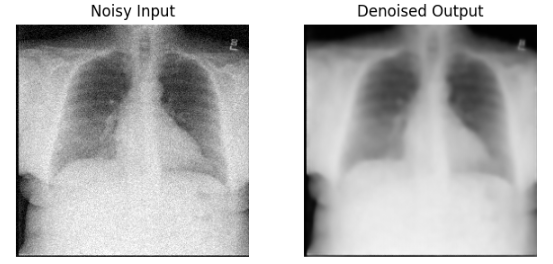

# x-ray-denoiser



This project investigates chest X-ray denoising as a medical image restoration task.
Instead of classification, it uses supervised pixel-to-pixel reconstruction: clean radiographs are treated as ground truth and synthetic Gaussian noise is injected on-the-fly during training.
Two architectures are compared in practice: a baseline U-Net and an Attention U-Net, with results analyzed using MSE and PSNR.


## Environment setup

Create and activate a virtual environment, then install dependencies:

```bash
/usr/bin/python3 -m venv .venv
source .venv/bin/activate
pip install -r requirements.txt
```

## Run training

Run from the repository root:

```bash
python src/train.py
```

Notes:
- The current `src/train.py` is configured to train `AttentionUNet`.
- To train the baseline U-Net instead, switch the commented model lines inside `src/train.py`.
- Checkpoints are saved to `models_checkpoints/` and training plots are saved to `images/`.

## Run inference

Run from the repository root:

```bash
python src/inference.py
```

Notes:
- The current `src/inference.py` loads `AttentionUNet` and auto-selects the latest `attention_unet*.pth` checkpoint unless `CHECKPOINT_NAME` is set.
- Inference comparison grids are saved into `images/`.

## File structure

```
x-ray-denoiser/
├── data/
│   ├── download/           # Downloaded NIH assets and extraction workspace
│   └── raw/                # Local image data used for training/inference
├── images/                 # Saved plots and qualitative comparison outputs
├── models_checkpoints/     # Trained model weights (.pth)
├── scripts/
│   └── ...                 # Helper scripts (dataset/report utilities)
└── src/
    ├── train.py            # Training loop, validation, checkpoint/plot saving
    ├── inference.py        # Loads checkpoint and generates denoising samples
    ├── compare_models.py   # Side-by-side model evaluation/visual comparison
    ├── dataset.py          # NIH dataset loader with synthetic noise injection
    ├── utils.py            # Plotting and metric helper functions
    └── models/
        ├── unet.py         # Baseline U-Net architecture
        ├── attention_unet.py  # Attention U-Net variant
        └── transformer.py  # Transformer-based denoising model
```