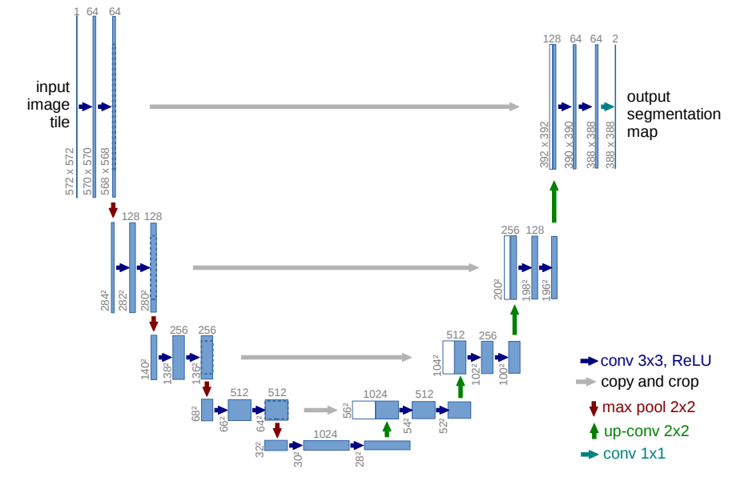
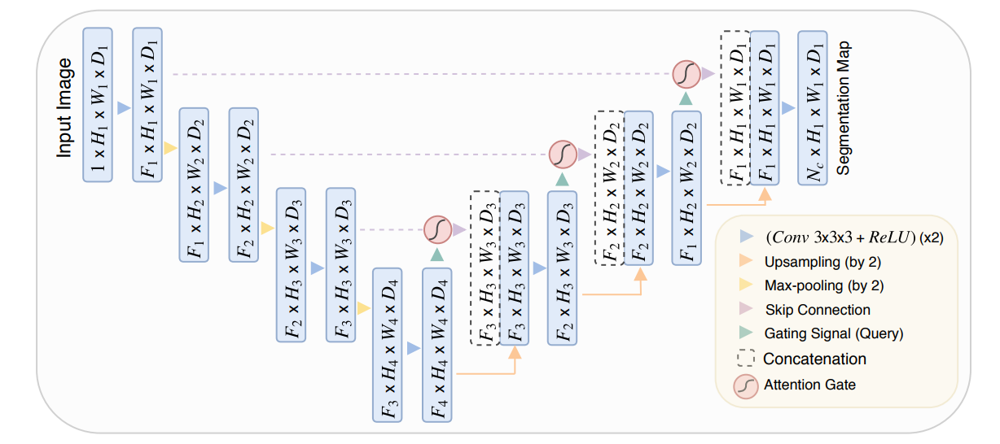
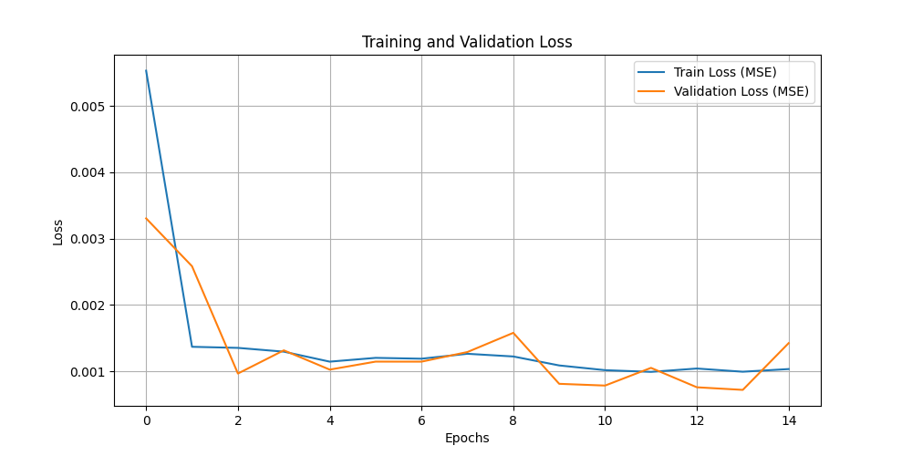
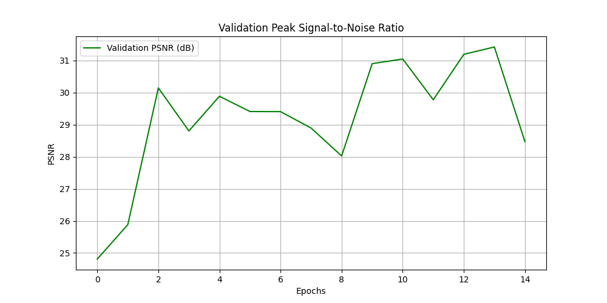
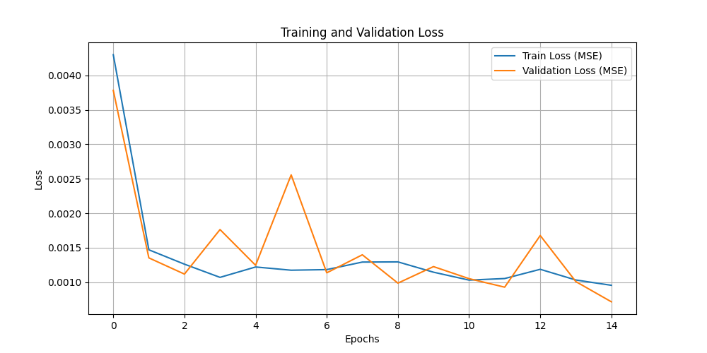
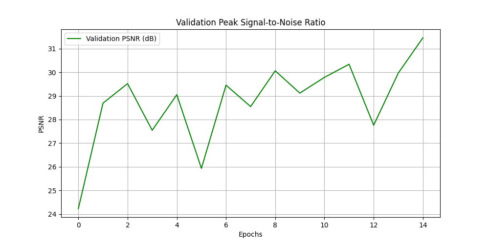
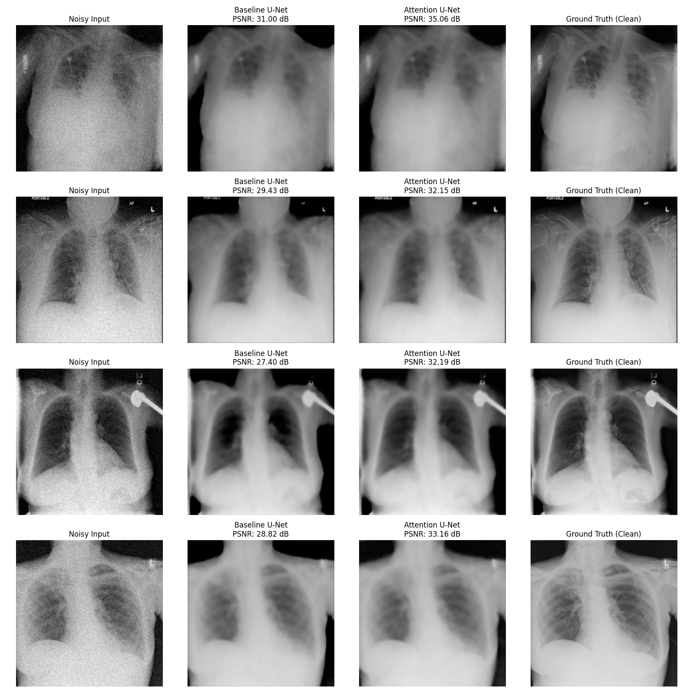

# Technical Report: Chest X-Ray Denoising

## 1. Problem Definition
The quality of medical images is a critical factor for diagnostic accuracy. In X-ray examinations, factors such as radiation dose reduction (for patient safety), hardware limitations, or mechanical degradation of the sensors frequently introduce noise during capture. This noise can obscure fine anatomical details, potentially leading to misdiagnoses. This project aims to solve this problem by building a Deep Learning system capable of performing image denoising on chest radiographs, computationally restoring the clarity of anatomical structures without degrading essential clinical details.

## 2. Justification of the Chosen Approach
The denoising task was selected over anomaly classification approaches for technical reasons and structural feasibility. Real-world medical datasets suffer from severe class imbalance (the vast majority of exams are healthy) and frequently imprecise labels, which would require extensive data engineering to avoid biased models.

By adopting denoising, we transform the problem into a pixel-to-pixel mapping task with a perfect and absolute Ground Truth. We use clean, high-quality radiographs as targets and synthetically generate noisy images as inputs. 

For the required experimentation flow, the project architecture opposes two variations of Convolutional Neural Networks (CNNs) for critical analysis:
* **CNN Model (Baseline):** A **U-Net** architecture developed from scratch. This was chosen for being the gold standard in medical image-to-image translation tasks. It utilizes symmetric encoding and decoding paths, connected via skip connections, to preserve the high-frequency spatial resolution of anatomical edges.
* **Attention-Based Model (Variation):** An **Attention U-Net**. This choice aims to evaluate whether integrating spatial attention mechanisms can surpass the standard convolutional network. The hypothesis is that attention gates can selectively focus the network's computational resources on salient anatomical structures (lungs, ribs, heart) while actively suppressing irrelevant background noise, leading to superior reconstruction quality.

## 3. Data Strategy and Preprocessing
The base data originates from the **NIH Chest X-ray Dataset**, a widely recognized benchmark in the medical machine learning domain. The processing pipeline was designed to maximize I/O throughput and local GPU processing efficiency (constrained by a 12GB VRAM limit):

* **Dynamic Pipeline:** Loading (via a custom PyTorch `Dataset` class) converts the original images to grayscale, reducing the input channel dimension to a single tensor. The pipeline then applies downsampling to a 256x256 pixel resolution, enabling the fast processing of larger batch sizes and accelerating the backpropagation steps.

* **On-the-fly Augmentation and Noise:** Instead of storing static pairs of clean and noisy images on disk, Gaussian noise is mathematically generated and added to the tensors at runtime (on-the-fly) during the data loading phase. This ensures that, at every single training epoch, the model is exposed to an entirely different noise pattern for the same underlying image. This acts natively as a highly effective data augmentation strategy, drastically reducing the chances of overfitting.

* **Physical Accuracy via Clipping:** After the noise injection, the pixel values are explicitly clamped (`torch.clamp`) to the $[0.0, 1.0]$ range. This operation is not merely a normalization step; it physically mimics real-world hardware sensors that have absolute saturation points, teaching the model how to handle clipped extreme outlier pixels safely.

## 4. Experiment Structure and Baseline Architecture (U-Net)

To adapt the project scope to the available time and computational resources (local training using a desktop environment), the dataset subset was defined at 1,500 images. The dataset was partitioned as follows:
* **Training:** 1,000 images (66%)
* **Validation:** 250 images (17%)
* **Testing:** 250 images (17%)

This proportion guarantees sufficient volume for the convolutional filters to learn the spatial hierarchies while reserving strictly isolated data for cross-validation during training and final metric evaluation.

The Baseline model implementation consisted of a **U-Net built from scratch** using PyTorch. The architecture acts as an encoder-decoder network. The encoder extracts features and reduces spatial dimensions using 4 levels of downsampling (Max Pooling) followed by double convolutions. A bottleneck block captures the deepest latent representations. The decoder reconstructs the image using 4 levels of upsampling (ConvTranspose2d). Crucially, skip connections concatenate the high-resolution feature maps from the encoder directly into the corresponding decoder layers, preventing the loss of spatial context. The output layer utilizes a Sigmoid activation function, ensuring that the predicted pixels map perfectly back to the $[0.0, 1.0]$ range.

## 5. Metrics and Training Strategy

The model was optimized using the **Adam** algorithm with an initial learning rate of $1 \times 10^{-3}$. The loss function chosen was the Mean Squared Error (**MSE**), which penalizes large pixel deviations between the generated image and the Ground Truth image. 

$$MSE = \frac{1}{N} \sum_{i=1}^{N} (y_i - \hat{y}_i)^2$$

To accelerate training and mitigate video memory constraints, the training loop was wrapped using PyTorch's native Automatic Mixed Precision (**AMP**) via `torch.amp.autocast`. This performs critical tensor calculations in 16-bit float precision (FP16) where supported by the Ampere architecture, significantly speeding up backpropagation without sacrificing gradient stability.

For the qualitative and quantitative analysis of the results, alongside the MSE loss curve, the project adopted the **PSNR (Peak Signal-to-Noise Ratio)** metric. Unlike MSE, PSNR is expressed in a logarithmic decibel (dB) scale and provides a standardized measure of image reconstruction quality. 

$$PSNR = 20 \cdot \log_{10}(MAX_I) - 10 \cdot \log_{10}(MSE)$$

Where $MAX_I$ is the maximum possible pixel value (1.0 in our normalized case). Higher PSNR values indicate that the model successfully removed the noise with minimal degradation of the original anatomical signal.

## 6. Architectural Variation: Attention U-Net

To fulfill the experimentation requirement and critically analyze different approaches, a second architecture was implemented: the **Attention U-Net**. 

While modern architectures like pure Vision Transformers (ViTs) provide powerful global context, they lack the inductive bias of convolutions, often requiring massive datasets and prolonged training times to converge—factors that are prohibitive in rapid prototyping scenarios. The Attention U-Net serves as a highly efficient hybrid solution. It maintains the robust convolutional backbone of the standard U-Net while integrating Attention Gates (AGs) into the skip connections.

**Justification for the Hybrid Approach:**
In standard U-Nets, skip connections concatenate high-resolution feature maps directly into the decoder. However, this introduces redundant, low-level background features (such as the empty black space around the patient's torso) that the model must expend computational effort to suppress in later layers. 

The Attention Block mathematically addresses this limitation by utilizing the gating signal from the decoder to "prune" the skip connection features *before* concatenation. The attention mechanism generates a spatial gating multiplier (ranging from 0 to 1 via a Sigmoid activation) that highlights salient anatomical structures while aggressively suppressing irrelevant background noise. This allows the model to leverage the conceptual benefits of attention—focusing computational resources on the most relevant spatial regions—without abandoning the parameter efficiency and rapid convergence associated with convolutional layers.

## 7. Critical Analysis of Results

The evaluation of the models revealed significant insights into the training dynamics of deep learning architectures under constrained data regimes. To properly assess the performance, the analysis is divided into the individual training behaviors of each model, followed by a comparative visual evaluation.

### 7.1. Baseline U-Net Training Dynamics

Analyzing the baseline learning curves above, the standard U-Net demonstrated rapid initial convergence. The training MSE dropped significantly within the first few epochs, indicating that the convolutional filters quickly grasped the basic noise distribution. However, the validation metrics exhibited noticeable volatility. The validation PSNR fluctuated sharply, with corresponding spikes in the validation loss. This erratic behavior is a classic symptom of optimizer overshooting. The static learning rate of $10^{-3}$ proved optimal for the initial, macroscopic weight adjustments but was too aggressive for the fine-tuning phase in later epochs, causing the Adam optimizer to oscillate around the local minima rather than settling smoothly.

### 7.2. Attention U-Net Training Dynamics

The integration of Attention Gates introduced different training dynamics. While the model also successfully minimized the training loss, the Attention U-Net had the dual task of learning the convolutional feature maps while simultaneously optimizing the spatial gating weights. Given the restricted dataset size (1,000 training images), learning to correctly map these attention masks adds complexity to the early epochs. The validation curves reflect this, showing that while attention mechanisms provide a more targeted approach to feature extraction, they can be highly sensitive to the learning rate and batch variance before the attention gates fully stabilize and learn to confidently suppress the background regions.

### 7.3. Visual Comparison and Final Conclusions

Upon inspecting the visual results via the inference grids, a well-documented phenomenon of the MSE loss function became distinctly apparent across both models: **oversmoothing**. While both the Baseline U-Net and the Attention U-Net successfully eliminated the synthetic Gaussian noise, the generated images appeared slightly blurry compared to the razor-sharp Ground Truth. Because the MSE function heavily penalizes large, localized outlier errors, the networks learn to minimize the loss by averaging out pixel values at high-frequency regions, which inevitably smooths out sharp anatomical edges like the clavicle and rib boundaries. 

Despite this shared MSE limitation, comparing the two architectures reveals the structural benefits of the Attention U-Net. By utilizing its spatial gating mechanism, it was able to focus its parameter updates strictly on the pulmonary and skeletal structures, effectively assigning lower weights to the irrelevant empty background space. This targeted approach generally resulted in slightly sharper contrast inside the lung cavity compared to the baseline, validating the hypothesis and proving the efficacy of attention mechanisms in medical imaging where the region of interest is highly localized.

## 8. Production Deployment Architecture

Transitioning this model from a local Python research environment into a robust, real-world clinical application requires decoupling the heavy machine learning inference from the user-facing systems. A modern, scalable production architecture would be structured as an asynchronous microservices ecosystem:

1. **Core Backend (TypeScript/Node.js):** The primary application logic should be handled by a robust TypeScript backend. This service acts as the API Gateway, managing clinical staff authentication, authorization, and metadata storage in a relational database (e.g., PostgreSQL). It is responsible for orchestrating the incoming radiograph files.
2. **Asynchronous Inference Pipeline:** Deep learning inference is computationally expensive and must never block the main backend event loop. When the TypeScript backend receives an X-ray via an HTTP POST request, it should instantly upload the raw file to an object storage bucket (e.g., AWS S3) and publish a message containing the file URI to a message broker (such as RabbitMQ or Apache Kafka). The backend can then return a "Processing" status to the client.
3. **Model Microservice (Python/FastAPI):** A dedicated, isolated Python microservice, running on GPU-enabled hardware, listens to the message queue. Upon receiving a task, it fetches the image, runs the PyTorch Attention U-Net inference script, saves the denoised output back to the object storage, and sends a webhook or event back to the main TypeScript backend signaling completion.
4. **Containerization & Scaling:** Both the backend and the Python inference microservice must be fully containerized using Docker. The inference service can be deployed on a Kubernetes cluster with GPU autoscaling policies. This allows the infrastructure to spin up additional Pods dynamically when the queue of X-rays to be processed grows during peak clinical hours, and scale down to save costs during the night.

## 9. Limitations and Future Work

While the implemented architectures successfully performed the denoising task, several limitations must be acknowledged for real-world clinical application:

**Synthetic vs. Physical Noise Distributions:**
The synthetic Gaussian noise injected during training does not perfectly model the complex, non-linear noise distributions captured by physical X-ray sensors (which frequently involve Poisson noise related to photon counting and hardware artifacts). A more clinically accurate approach would require a dataset of paired low-dose (naturally noisy) and high-dose (clean) radiographs from the same patients. The synthetic Gaussian approach was adopted here primarily to satisfy the prototyping constraints of this academic exercise.

**Clinical Safety and Metric Limitations:**
Furthermore, raw noise reduction does not automatically equate to a successful medical model. Standard pixel-wise metrics like PSNR do not inherently measure the preservation of critical semantic regions. As observed with the MSE oversmoothing effect, a model might achieve a high PSNR while simultaneously obliterating minute pathological features, such as early-stage pulmonary nodules or microcalcifications. 

**Future Work (Task-Aware Denoising):**
To ensure diagnostic safety, future iterations must implement structure-preserving metrics (such as SSIM) rather than relying solely on pixel-wise differences. A highly promising avenue for future development is to couple the denoising network with a pre-trained disease classification model. By utilizing the classifier's feature maps to compute a "perceptual loss" or task-aware loss, the system could receive feedback to ensure that the denoising process actively preserves the specific anatomical textures and structures required for accurate pathology classification.

## 10. References

1. Olaf Ronneberger, Philipp Fischer, and Thomas Brox. *U-Net: Convolutional Networks for Biomedical Image Segmentation*. MICCAI 2015. https://arxiv.org/abs/1505.04597
2. Ozan Oktay, Jo Schlemper, Loic Le Folgoc, et al. *Attention U-Net: Learning Where to Look for the Pancreas*. arXiv 2018. https://arxiv.org/abs/1804.03999